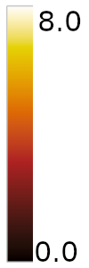
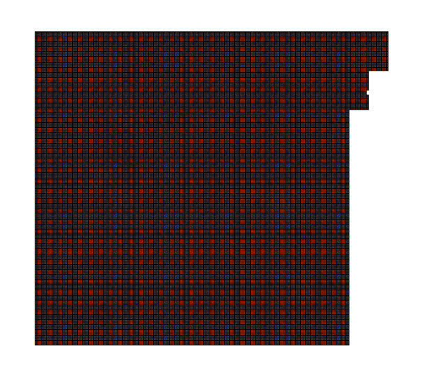
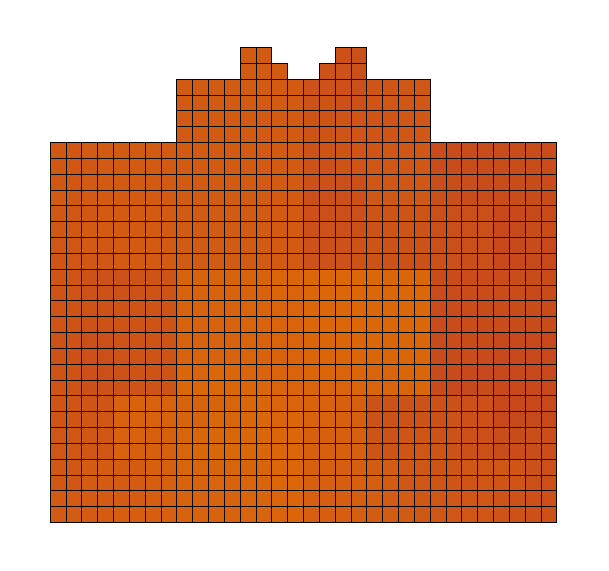
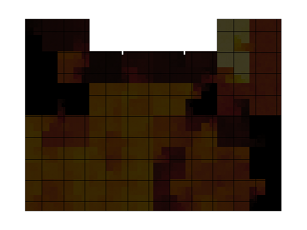

Entropy Visualization
=====================

The entropy of any data can tell something about the data itself.  Homogeneous content with few
repeating patterns has low entropy while purely random data has high entropy.  From just the
entropy value of file it is possible to distinguish a text file from a compressed text file.

There are several measures of entropy. Adequate for the problem at hand is Shannon definition:

   H(X) = -Σᵢ P(xᵢ) logₐ(P(xᵢ))

We can, for instance, count the number of occurrences of each of the 256 possible byte values
in a file and and derive from it the probability of each byte.  These probabilities can be
plugged into the formula to arrive at an entropy measure.

Instead of iterating over the entire file content to compute the individual bytes' probability
it is also possible to use only look at a range in the file to get a local measure of entropy.
By sliding the range over the entire file content one can compute local entropy values.

File Entropy
------------

The `file-entropy.py` script takes a file name it computes a graphical representation of the
local entropy at all points of the file.  The probabilities are computed for a sliding window
and the computed entropy value is used as the result for the central byte of the window.  At the
beginning and end of the file smaller, lop-sided intervals are used.  The entropy value is displayed
using different colors from a color map.  By default the Black Body color map below is used.

Given that the window size is 256 bytes and there are 256 different byte values, the maximum
possible entropy inside a window is 8, as can be verified with simple calculations:

In addition to the display on screen it is possible to create a Postscript output file.  To do this
pass on the command line a second argument which is used as the name of the output file.

Layout
------

The file content is displayed along a Hilbert curve of appropriate dimension.  The benefit over
this layout instead of a sequential layout right-to-left, top-to-bottom is that neighboring bytes
of the file are in a 2-dimensional neighborhood.  This makes visual inspection and also image handling
techniques using neural networks easier.

The dimension of a full Hilbert curve require a square area with side length that are a power of two.
To accomodate arbitrary-sized file sizes partial curves are used.  The algorithms determines size
for the result which is not necessarily a square anymore.  It tries to minimize the area of the
rectangular image that are unused.  The unused cells are displayed as white.

Restriction
-----------

The code as it is written right now is just for experimentation.  It is not optimized for speed
at all and displaying large files will require a lot of time and probably memory.

Examples
--------

The first file is a text with just ASCII characters.  Letters, punctuation, and spacing in this
specific text file require 77 different code points and likely only a subset of those in any
256-byte window.  The resulting entropy map shows this:

The entropy is quite uniform and low, as expected.

A different story is a purely random file.

As expected, the entropy is uniform as well and it is higher.

Neither of these examples is really interesting.  We can apply the tool to other types of files.
For instance, the following is the result of inspecting the `echo` binary.

We can see the file's entropy is not homogeneous.  By analyzing the known structure of the file
we can assign different entropy values to the different type of data and/or code in the file.
